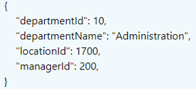

# API

这个Project跟随solenovex的[使用ASP.NET Core 3.x 构建RESTful Web API](https://www.bilibili.com/video/BV1XJ411q7yy)完成。
笔记也根据课件整理，[这里](https://github.com/solenovex/ASP.NET-Core-3.x-REST-API-Tutorial-Code)是solenovex的源码和PPT地址。

## WebAPI简介

### 什么是Web API?

- Web API通常是指“使用HTTP协议并通过网络调用的API”，由于它使用了HTTP协议，所以需要通过URI信息来指定端点。

- Web API就是一个Web系统，通过访问URI可以与其进行信息交互。

### **大多数的** Web **API** **并不是** RESTful API

- Roy Fielding为REST风格的API制定了一套约束规范或者叫**架构风格**

### MVC模式

- MVC（Model-View-Controller）是一种主要用来构建UI的架构模式。

- 松耦合

- 关注点分离（separation of concerns）

- MVC不是一个完整的应用程序架构

### MVC映射为API呢

- Model，它负责处理程序数据的逻辑。

- View，它是程序里负责展示数据的那部分。在构建API的时候，View就是数据或资源的展示。现在通常使用JSON格式。

- Controller，它负责View和Model之间的交互。


### ASP.NET Core 请求管道


## REST简介

### 什么是REST?

- Representational State Transfer（状态表述转换）
- 它描述了Web应用到底怎么样设计才算是优良的。这里定义了以下三点：
- - 一组网页的网络（一个虚拟状态机）；
  - 在这些网页上，用户可以通过点击链接来前进（状态转换）；
  - 点击链接的结果就是下一个网页（表示程序的下一个状态）被传输到用户那里，并渲染好给用户使用。

### REST是一种架构风格

- REST是一种**架构风格**，而不是规范或标准；
- REST需要使用一些规范、协议或标准来实现这种架构风格；
- REST与协议无关。JSON并不是REST强制的，甚至HTTP都不是REST强制使用的，但这也仅仅是从理论上来看。

### REST的优点

- 性能。
- 组件交互的可扩展性。
- 组件的可修改性。
- 可移植性。
- 可靠性。
- 可视性。

### REST的约束


### **Richardson** 成熟度模型

#### Level 0，POX（Plain old xml）沼泽


#### Level 1，资源

url不同了


#### Level 2，动词

动词用对了，状态码也对


#### Level 3，超媒体

超链接里有修改等的连接


根据Roy Fielding博士的描述，达到Level 3也仅仅是RESTful API的一个前提。


## 对外合约

### API消费者需要使用到三个概念

- 资源的标识。
- HTTP方法。
- 有效载荷（可选），英文就是Payload。

### 资源命名

#### 使用名词，而不是动词

- 需求：我们看这样一个需求的例子：“我想获得系统里所有的用户”。
- 常见错误做法：api/getusers。
- 分析：这个句话的主要动词就是“获取”，而想要获取的资源（也就是主要的名词）是“用户”。
- 正确的做法：GET api/user。

#### 人类能读懂

- 还是上面那个需求：“我想获得系统里所有的用户”。
- 我们可以把uri设计成 api/u 或者 api/ur。
- 所以建议的做法是要足够友好，并且比较简短，例如：api/users。

#### 要体现资源的结构/关系

- 假设如果后端API系统里面有若干种资源，而用户这个资源与其它的资源并没有直接的关系，这样的话获取用户资源的uri应该是 api/users。而不是 api/products/users，也不是api/catalogs/products/users，因为user和product或者catalog没有直接的关系。
- 通过id获取单个用户的uri应该是：api/users/{userId}，而不是api/userid/users。
- 这样写的好处是可以让API具有很好的可预测性和一致性。

#### 例子1

- **需求：**系统里有两类资源，公司（Company）和员工（Employee）。现在我想获取某个公司下所有的员工信息。
- **分析：**使用HTTP的GET。API的URI在设计的时候需要体现公司和员工的包含关系。
- **常见的错误做法：**：api/employees，api/employees/{companyId}等等。
- **建议的做法**：GET api/companies/{companyId}/employees。

#### 例子2

- **需求**：我想获取某个公司的某个员工信息。
- **常见的错误做法**：api/employees/{employeeId}，api/companies/{employeeId}等等。
- **建议的做法**：api/companies/{companyId}/employees/{employeeId}。

#### **自定义查询怎么命名**

- **需求**：“我想获取所有的用户信息，并要求结果是按年龄从小到大进行排列的”。
- **常见错误的做法**：api/users/orderby/age。
- **建议的做法**：api/users?orderby=name。

#### 例外

- 有一些需求总是无法满足的达到RESTful的约束。
- **需求**：“我想获取系统里所有用户的数量”。
- **妥协的做法**：例如：api/users/totalamountofuser。

### **ControllerBase**

- Controller类继承于ControllerBase，Controller添加了对视图的支持，因此它更适合用于处理 MVC Web 页面，而不是 Web API。但是如果你的Controller需要同时支持MVC Web页面和Web API，那么这时候就应该继承于Controller这个类。
- ControllerBase 类提供了很多用于处理 HTTP 请求的属性和方法。 例如，ControllerBase.CreatedAtAction 返回 201 状态代码。

### [ApiController]

- 这个属性是应用于Controller的，它其实并不是强制的。
- 会启用以下行为：
- 要求使用属性路由（[Attribute Routing](https://docs.microsoft.com/zh-cn/aspnet/core/mvc/controllers/routing?WT.mc_id=DT-MVP-5003302&view=aspnetcore-3.0)）。
- 自动HTTP 400响应。
- 推断参数的绑定源。
- Multipart/form-data 请求推断。
- 错误状态代码的问题详细信息。


## HTTP方法

不同的动作可以作用于相同的资源URI，例如获取一个公司（api/company/3）和删除一个公司（api/company/3）的URI就是一样的。但是它们的HTTP方法则不同，一个是GET，一个是DELETE。下面我们就来看看那些动作应该对应哪些 HTTP 方法。

### POST

需求：添加一个公司信息


**HTTP请求图解**


### GET

#### 获取一个公司

需求：获取一个公司信息


**HTTP请求图解**


#### 获取集合资源


**HTTP图解**


### DELETE

需求：删除一个公司

返回204


**HTTP图解**


### PATCH

需求：更新公司信息

返回状态码


**HTTP图解**


#### PUT

需求：替换公司信息。

整体替换：返回状态码

原本无资源，等同于POST，返回新创建的资源


**HTTP图解**


### 总结


### HTTP状态码

- 请求是否执行成功了
- 如果请求失败了，那么谁为它负责

#### 1XX

属于信息性的状态码, Web API并不使用1xx的状态码。

#### 2XX

- 意味着请求执行的很成功。
  - 200 - Ok，表示请求成功；
  - 201 - Created，请求成功并创建了资源；
  - 204 - No Content，请求成功，但是不应该返回任何东西，例如删除操作。

#### 3XX

用于跳转。例如告诉搜素引擎，某个页面的网址已经永久的改变了。绝大多数的Web API都不需要使用这类状态码。

#### 4XX

- 客户端错误：
  - 400 - Bad Request，表示API消费者发送到服务器的请求是有错误的；
  - 401 - Unauthorized，表示没有提供授权信息或者提供的授权信息不正确；
  - 403 - Forbidden，表示身份认证已经成功，但是已认证的用户却无法访问请求的资源；
  - 404 - Not Found，表示请求的资源不存在；
  - 405 - Method not allowed，当尝试发送请求到资源的时候，使用了不被支持的HTTP方法时，就会返回405状态码；
  - 406 - Not acceptable，这表示API消费者请求的表述格式并不被Web API所支持，并且API不会提供默认的表述格式。
  - 409 - Conflict，表示请求与服务器当前状态冲突。通常指更新资源时发生的冲突，例如，当你编辑某个资源的时候，该资源在服务器上又进行了更新，所以你编辑的资源版本和服务器的不一致。当然有时候也用来表示你想要创建的资源在服务器上已经存在了。它就是用来处理并发问题的状态码。 
  - 415 - Unsupported media type，与406正好相反，有一些请求必须带着数据发往服务器，这些数据都属于特定的媒体类型，如果API不支持该媒体类型格式，415就会被返回。
  - 422 - Unprocessable entity，它是HTTP扩展协议的一部分。它说明服务器已经懂得了实体的Content Type，也就是说415状态码肯定不合适；此外，实体的语法也没有问题，所以400也不合适。但是服务器仍然无法处理这个实体数据，这时就可以返回422。所以它通常是用来表示语意上有错误，通常就表示实体验证的错误

#### 5XX

- 5xx，服务器错误：
  - 500 - Internal server error，表示服务器出现了错误，客户端无能为力，只能以后再试试了。

### 错误和故障（Error vs Faults）

#### 错误 Errors

- 错误通常是由API的消费者引起的。API消费者请求时传递的数据是不合理的，这时API就会正常的将其拒绝。
- HTTP 4xx错误。 
- 并不会影响API的可用性。

#### **故障** Faults

- 故障是指：针对一个合理的请求，API无法返回它的响应。 换句话说就是API引起的问题。
- HTTP 5xx错误。
- 会对API整体的可用性造成影响。

## 内容协商 Content Negotiation

内容协商是这样一个过程：针对一个响应，当有多种表述格式可用的时候，选取最佳的一个表述。

### Accept Header 

使用的人填写，如果不填就用默认的方式响应

- Media Type（媒体类型）
  - application/json
  - application/xml
  - …
- 406 Not Acceptable （如果填写的格式不支持）
- 输出格式
- ASP.NET Core 里面对应的就是 **Output Formatters**

```C#
services.AddControllers(
setup=>setup.ReturnHttpNotAcceptable = true //406
setup=>setup.OutputFormatters.Add(new XmlDataContractSerializerOutputFormatter()//将xml添加进可选的返回格式
setup=>setup.OutputFormatters.Insert(0,new XmlDataContractSerializerOutputFormatter())//将xml加入第零个位置，则将默认变为xml
);
    
//406+添加一个xml
       services.AddControllers(
setup=>setup.ReturnHttpNotAcceptable = true).AddXmlDataContractSerializerFormatters();
```


### Content-Type Header

自描述信息，告诉服务器如何处理传来的参数

- Media Type（媒体类型）
  - application/json
  - application/xml
  - …
- 输入格式
- ASP.NET Core 里面对应的就是 **Input formatters**。


## Entity Model vs 面向外部的Model

### Entity Model

Entity Framework Core 使用的 Entity Model 是用来表示数据库里面的记录的。

### 面向外部的Model

而面向外部的 model 则表示了要传输的东西。这类 model 有时候叫做 Dto(data transfer object)，有时候叫做 ViewModel。

### 对比


Name = FirstName + LastName

DateOfBirth=>Age 

Salary 可能存放在另一个表，可能从另一个restfulAPI获取，等更多情况，反正有一定的关联

### Entity Model 和 面向外部的Model 应该分开

更加健壮、可靠和更易于进化。

比如，当数据库变化Entity Model就要变化，但Dto可能不需要改，不然的话消费者可能会遇到问题。

其次，版本控制会遇到问题，两者要独立进化。

## ActionResult<T>

`Task<IActionResult>` => ` Task<ActionResult<IEnumerable<CompanyDto>>>`

```C#
  public async Task<ActionResult<IEnumerable<CompanyDto>>> GetCompanies()
        {

            var companies = await _companyRepository.GetCompaniesAsync();
            var companyDtos = new List<CompanyDto>();
            foreach (var company in companies)
            {
                companyDtos.Add(new CompanyDto
                {
                    Id = company.Id,
                    Name = company.Name
                });
            }
            //404 NotFound();
            return Ok(companyDtos);
           //return Ok();
          //return companyDtos;
        }
```

## AutoMapper

1. 安装AutoMapper

2. 注入服务

   `services.AddAutoMapper(AppDomain.CurrentDomain.GetAssemblies());`

   参数代表查找配置

3. 配置映射

   1. 创建文件夹`Profils`

   2. 在该文件夹下创建一个类`CompanyProfile`

      ```C#
      namespace Routine.Api.Profiles
      {
          public class CompanyProfile : Profile
          {
              public CompanyProfile()
              {
                  //创建映射
                  //这里，一个叫Name一个叫CompanyName，所以要手动处理
                  //dest是目标，opt是一个参数说明dest从哪里映射，src表示源头
                  CreateMap<Company, CompanyDto>().ForMember(dest => dest.CompanyName, opt => opt.MapFrom(src => src.Name));
              }
          }
      }
      ```

   3. 创建`mapper`实例

      ```c#
      private readonly ICompanyRepository _companyRepository;
              private readonly IMapper _mapper;
      
              public CompaniesController(ICompanyRepository _companyRepository,IMapper mapper)
              {
                  this._companyRepository = _companyRepository ?? throw new ArgumentException(nameof(CompanyRepository));
                  _mapper = mapper ?? throw new ArgumentException(nameof(mapper));
              }
      ```

   4. 使用

      ```c#
      var companyDtos = _mapper.Map<IEnumerable<CompanyDto>>(companies);
      //泛型是要返回的类型，括号中的是需要被映射的原始数据
      ```

      

## 获取父子关系的资源

### 创建EmployeesController, EmployeeDto, EmployeeProfile

**EmployeesController**

```C#
 public class CompaniesController : ControllerBase
    {
        private readonly ICompanyRepository _companyRepository;
        private readonly IMapper _mapper;

        public CompaniesController(ICompanyRepository _companyRepository,IMapper mapper)
        {
            this._companyRepository = _companyRepository ?? throw new ArgumentException(nameof(CompanyRepository));
            _mapper = mapper ?? throw new ArgumentException(nameof(mapper));
        }
        [HttpGet]
        public async Task<ActionResult<IEnumerable<CompanyDto>>> GetCompanies()
        {

            var companies = await _companyRepository.GetCompaniesAsync();
            var companyDtos = _mapper.Map<IEnumerable<CompanyDto>>(companies);
            return Ok(companyDtos);
            
        }

        [HttpGet("{companyId}")] //api/Companies/{companyId}
        public async Task<ActionResult<CompanyDto>> GetCompany(Guid companyId)
        {
            var company = await _companyRepository.GetCompanyAsync(companyId);
            if (company == null) return NotFound();
            //return NotFound(); 404
            return Ok(_mapper.Map<CompanyDto>(company));
        }

    }
```

**EmployeeDto**

```C#
 public class EmployeeDto
    {
        public Guid Id { get; set; }
        public Guid CompanyId { get; set; }
        public string EmployeeNo { get; set; }
        public string Name { get; set; }
        public string GenderDisplay { get; set; }
        public int Age { get; set; }
 
    }
```

**EmployeeProfile**

```c#
public class EmployeeProfile : Profile
    {
        public EmployeeProfile()
        {
            CreateMap<Employee, EmployeeDto>().ForMember(dest => dest.Name,
                    opt => opt.MapFrom(src => $"{src.FirstName}{src.LastName}"))
                .ForMember(dest => dest.GenderDisplay, opt => opt.MapFrom(src => src.Gender.ToString()))
                .ForMember(dest => dest.Age, opt => opt.MapFrom(src => DateTime.Now.Year - src.DateOfBirth.Year));

        }
```


## 异常处理

非管理员模式的时候，我们不希望把错误暴露给用户，所以我们使用这个来处理异常

```c#
            app.UseExceptionHandler(appBuilder=>
            {
                appBuilder.Run(async context =>
                {
                    context.Response.StatusCode = 500;
                    await context.Response.WriteAsync("Unexpected Error!");
                });
            });
```


## HTTP HEAD

- HEAD 和 GET 几乎是一样的
- 只是有一点重要的不同：HEAD 的 API 不应该返回响应的 body
- HEAD 可以用来在资源上获取一些信息。

```c#
[HttpGet]
[HttpHead]
public async Task<ActionResult<IEnumerable<CompanyDto>>> GetCompanies()
 {
// throw new Exception("An Exception");
var companies = await _companyRepository.GetCompaniesAsync();
            var companyDtos = _mapper.Map<IEnumerable<CompanyDto>>(companies);
            return Ok(companyDtos);
            
        }
```

## 过滤和搜索

### 如何给API传递数据

- 数据可以通过多种方式来传给API。
- Binding source Attributes 会告诉 Model 的绑定引擎从哪里找到绑定源。

### Binding source Attributes

- [FromBody]，请求的 Body
- [FromForm]，请求的 Body 中的 form数据
- [FromHeader]，请求的 Header
- [FromQuery]，Query string 参数
- [FromRoute]，当前请求中的路由数据
- [FromService]，作为 Action 参数而注入的服务 


### [ApiController]

- 默认情况下ASP.NET Core 会使用 Complex Object Model Binder，它会把数据从Value Providers那里提取出来，而Value Providers的顺序是定义好的。
- 但是我们构建API时通常会使用 [ApiController] 这个属性，为了更好的适应API它改变了上面的规则。

#### [ApiController]更改后的规则

- [FromBody]，通常是用来推断复杂类型参数的。

- [FromForm]，通常用来推断IFormFile和IFormFileCollection类型的参数。

- [FromRoute]，用来推断Action的参数名和路由模板中的参数名一致的情况。

- [FromQuery]，用来推断其他参数

  

### 过滤

- 过滤集合的意思就是指根据条件限定返回的集合。
- 例如我想返回所有类型为国有企业的欧洲公司。则URI为：`GET /api/companies?type=State-owned&region=Europe`
- 所以过滤就是指：我们把某个字段的名字以及想要让该字段匹配的值一起传递给API，并将这些作为返回的集合的一部分。

#### Code

##### EmployeesController

```C#
  public async Task<ActionResult<IEnumerable<EmployeeDto>>> GetEmployeesForCompany(Guid companyId,[FromQuery(Name = "gender")]string genderDisplay)
        {
            if (!await _companyRepository.CompanyExistsAsync(companyId))
            {
                return NotFound();
            } 

            var employees = await _companyRepository.GetEmployeesAsync(companyId,genderDisplay);
            var employeeDtos = _mapper.Map<IEnumerable<EmployeeDto>>(employees);
            return Ok(employeeDtos);
        }
```

##### CompanyRepository

```c#
    public async Task<IEnumerable<Employee>> GetEmployeesAsync(Guid companyId,string genderDisplay)
        {
            if (companyId == Guid.Empty)
            {
                throw new ArgumentNullException(nameof(companyId));
            }

            if (string.IsNullOrWhiteSpace(genderDisplay))
            {
                return await _context.Employees.Where(x => x.CompanyId == companyId).OrderBy(x => x.EmployeeNo)
                    .ToListAsync();
            }

            var genderStr = genderDisplay.Trim();
            var gender = Enum.Parse<Gender>(genderStr);
            return await _context.Employees.Where(x => x.CompanyId == companyId && x.Gender == gender).OrderBy(x => x.EmployeeNo)
                .ToListAsync();
        }
```


### 搜索

- 针对集合进行搜索是指根据预定义的一些规则，把符合条件的数据添加到集合里面。
- 搜索实际上超出了过滤的范围。针对搜索，通常不会把要匹配的字段名传递过去，通常会把要搜索的值传递给API，然后API自行决定应该对哪些字段来查找该值。经常会是全文搜索。
- 例如：GET /api/companies?q=xxx

#### Code

##### EmployeesController

```C#
 [HttpGet]
        public async Task<ActionResult<IEnumerable<EmployeeDto>>> GetEmployeesForCompany(Guid companyId,[FromQuery(Name = "gender")]string genderDisplay,string q)
        {
            if (!await _companyRepository.CompanyExistsAsync(companyId))
            {
                return NotFound();
            } 

            var employees = await _companyRepository.GetEmployeesAsync(companyId,genderDisplay,q);
            var employeeDtos = _mapper.Map<IEnumerable<EmployeeDto>>(employees);
            return Ok(employeeDtos);
        }
```

##### CompanyRepository

```c#
public async Task<IEnumerable<Employee>> GetEmployeesAsync(Guid companyId, string genderDisplay, string q)
        {
            if (companyId == Guid.Empty)
            {
                throw new ArgumentNullException(nameof(companyId));
            }

            if (string.IsNullOrWhiteSpace(genderDisplay) && string.IsNullOrWhiteSpace(q))
            {
                return await _context.Employees.Where(x => x.CompanyId == companyId).OrderBy(x => x.EmployeeNo)
                    .ToListAsync();
            }

            var items = _context.Employees.Where(x => x.CompanyId == companyId);
            if (!string.IsNullOrWhiteSpace(genderDisplay))
            {
                genderDisplay = genderDisplay.Trim();
                var gender = Enum.Parse<Gender>(genderDisplay);

                items = items.Where(x => x.Gender == gender);

            }

            if (!string.IsNullOrWhiteSpace(q))
            {
                q = q.Trim();
                items = items.Where(x => x.EmployeeNo.Contains(q)
                                         || x.FirstName.Contains(q) || x.LastName.Contains(q));
            }
            return await items.OrderBy(x => x.EmployeeNo).ToListAsync();
        }
```

### 过滤 VS 搜索

过滤：首先是一个完整的集合，然后根据条件把匹配/不匹配的数据项移除。

搜索：首先是一个空的集合，然后根据条件把匹配/不匹配的数据项往里面添加。

#### 注意

1. 过滤和搜索这些参数并不是资源的一部分。
2. 只允许针对资源的字段进行过滤。（比如EmployeeDeto里的Name而不是Employee里的FirstName + LastName）

### 查询参数

#### CompanyRepository

```C#
 public async Task<IEnumerable<Company>> GetCompaniesAsync(CompanyDtoParameters parameters)
        {
            if (parameters == null)
            {
                throw new ArgumentNullException(nameof(parameters));
            }

            if (string.IsNullOrWhiteSpace(parameters.CompanyName) && string.IsNullOrWhiteSpace(parameters.SearchTerm))
            {
                return await _context.Companies.ToListAsync();
            }

            var queryExpression = _context.Companies as IQueryable<Company>;
            if (!string.IsNullOrWhiteSpace(parameters.CompanyName))
            {
                parameters.CompanyName = parameters.CompanyName.Trim();
                queryExpression = queryExpression.Where(x => x.Name == parameters.CompanyName);
            }

            if (!string.IsNullOrWhiteSpace(parameters.SearchTerm))
            {
                parameters.SearchTerm = parameters.SearchTerm.Trim();
                queryExpression = queryExpression.Where(x =>
                    x.Name.Contains(parameters.SearchTerm) || x.Introduction.Contains(parameters.SearchTerm));

            }

            return await queryExpression.ToListAsync();
        }
```

#### CompaniesController

```c#
  public async Task<ActionResult<IEnumerable<CompanyDto>>> GetCompanies([FromQuery]CompanyDtoParameters parameters)
        {
           // throw new Exception("An Exception");
            var companies = await _companyRepository.GetCompaniesAsync(parameters);
            var companyDtos = _mapper.Map<IEnumerable<CompanyDto>>(companies);
            return Ok(companyDtos);
            
        }
```

#### CompanyDtoParameters

```c#
 public class CompanyDtoParameters
    {
        public string CompanyName { get; set; }
        public string SearchTerm { get; set; }
    }
```

## HTTP方法的安全性和幂等性

- **安全性**是指方法执行后并不会改变资源的表述。
- **幂等性**是指方法无论执行多少次都会得到同样的结果


GET没有副作用，多次GET结果相同，别人改了和他无关。

POST会创建资源所以不安全也不幂等，多次POST创建多次资源。

DELETE执行多次效果相同所以幂等。。

PUT结果相等，资源整体替换，而PATCH是局部更新。比如一个资源有一个属性，是一个数组，patch第一次数组一条记录，两次两条，所以每次都不同。


## POST：创建资源

### 创建Company资源 POST

我们从Body那里获得的数据要被封装在一个类中，这个类要和返回类不同。所以，我们得知，创建一个类，更新一个类，返回一个类。

#### CompanyAddDto

和用户传给我们的参数一一对应。

```c#
 public class CompanyAddDto
    {
        public string Name { get; set; }
        public string Introduction { get; set; }

    }
```

注意，我们也需要将它映射回Company才可以进行后续的操作，所以我们要回到CompanyProfile进行映射

```c#
CreateMap<CompanyAddDto, Company>();
```

#### CompaniesController

```c#

        [HttpPost]
        public async Task<ActionResult<CompanyDto>> CreateCompany([FromBody]CompanyAddDto company)
        {
            var entity = _mapper.Map<Company>(company);
            _companyRepository.AddCompany(entity);
            await _companyRepository.SaveAsync();
            var returnDto = _mapper.Map<CompanyDto>(entity);
            return CreatedAtRoute(nameof(GetCompany), new {companyId = returnDto.Id},returnDto);

        }
```

注意，我们最后返回给了用户一个连接，这个连接是重定向到Get请求的，所以我们也要给Get请求搞个名字。

```c#

      [HttpGet("{companyId}",Name = nameof(GetCompany))] //api/Companies/{companyId}
        public async Task<ActionResult<CompanyDto>> GetCompany(Guid companyId)
        {
            var company = await _companyRepository.GetCompanyAsync(companyId);
            if (company == null) return NotFound();
            //return NotFound(); 404
            return Ok(_mapper.Map<CompanyDto>(company));
        }

```

### 创建子资源 POST

#### EmployeeAddDto

```c#
  public class EmployeeAddDto
    {
        public string EmployeeNo { get; set; }
        public string FirstName { get; set; }
        public string LastName { get; set; }
        public Gender Gender { get; set; }
        public DateTime DateOfBirth { get; set; }
    }
```

#### EmployeesController

```c#
 public async Task<ActionResult<EmployeeDto>> CreateEmployeeForCompany(Guid companyId, EmployeeAddDto employee)
        {
            if (!await _companyRepository.CompanyExistsAsync(companyId))
            {
                return NotFound();
            }

            var entity = _mapper.Map<Employee>(employee);
            _companyRepository.AddEmployee(companyId,entity);
            await _companyRepository.SaveAsync();
            var dtoToReturn = _mapper.Map<EmployeeDto>(entity);
            return CreatedAtRoute(nameof(GetEmployeeForCompany),
                new {companyId = companyId, employeeId = dtoToReturn.Id}, dtoToReturn);
        }
```

### 同时创建父子资源

1. 在CompanyAddDto中添加:

` public ICollection<EmployeeAddDto> Employees { get; set; } = new List<EmployeeAddDto>();`

### 同时创建多个资源

#### CompanyCollectionsController

```c#
public class CompanyCollectionsController : ControllerBase
    {
        private readonly IMapper _mapper;
        private readonly ICompanyRepository _companyRepository;

        public CompanyCollectionsController(IMapper mapper, ICompanyRepository companyRepository)
        {
            _mapper = mapper ?? throw new ArgumentNullException(nameof(mapper));
            _companyRepository = companyRepository ?? throw new ArgumentNullException(nameof(companyRepository));
        }

        [HttpPost]
        public async Task<ActionResult<IEnumerable<CompanyDto>>> CreateCompanyCollection(
            IEnumerable<CompanyAddDto> companyCollection)
        {
            var companyEntities = _mapper.Map<IEnumerable<Company>>(companyCollection);
            foreach (var company in companyEntities)
            {
                _companyRepository.AddCompany(company);
            }

            await _companyRepository.SaveAsync();
            return Ok();
        }
    }
```

#### 自定义Model绑定器

##### ArrayModelBinder

```c#
     public class ArrayModelBinder : IModelBinder
    {
        public Task BindModelAsync(ModelBindingContext bindingContext) //Context里是Model的源数据
        {
            //方法的参数是IEnumerable类型，使得ArrayModelBinder作用于此类型。
            if (!bindingContext.ModelMetadata.IsEnumerableType) //判断它所作用的类型是不是IEnumerable
            {
                bindingContext.Result=ModelBindingResult.Failed();
                return Task.CompletedTask;
            }
            //获得值，ValueProvider就是值的提供者，From Route 或者 From Query它们就是值提供者。
            //{Microsoft.AspNetCore.Mvc.ModelBinding.RouteValueProvider}
            //bindingContext.ModelName就是ids
            var value = bindingContext.ValueProvider.GetValue(bindingContext.ModelName).ToString();
            if (string.IsNullOrWhiteSpace(value))
            {
                //传递的参数是空的
                bindingContext.Result = ModelBindingResult.Success(null);
                return Task.CompletedTask;
            }
            //获得IEnumerable里面的类型
            var elementType = bindingContext.ModelType.GetTypeInfo().GenericTypeArguments[0];
            //创造转换器,把字符串变成GUID
            var converter = TypeDescriptor.GetConverter(elementType);
            //分割字符串然后用转换器转换
            var values = value.Split(new[] {","}, StringSplitOptions.RemoveEmptyEntries)
                .Select(x => converter.ConvertFromString(x.Trim())).ToArray();
            //设置数组类型
            var typedValues = Array.CreateInstance(elementType, values.Length);
            //把值拷贝到typedValues里面去
            values.CopyTo(typedValues,0);
            //得到Model
            bindingContext.Model = typedValues;
            bindingContext.Result = ModelBindingResult.Success(bindingContext.Model);
            return Task.CompletedTask;
        }
    }
```

##### CompanyCollectionsController

```c#
  [HttpGet("{ids}",Name = nameof(GetCompanyCollection))]
        public async Task<IActionResult> GetCompanyCollection(
            [FromRoute]
            [ModelBinder(BinderType = typeof(ArrayModelBinder))]
            IEnumerable<Guid> ids)
        {
            if (ids == null)
            {
                return BadRequest();
            }

            var entities = await _companyRepository.GetCompaniesAsync(ids);
            if (ids.Count() != entities.Count())
            {
                return NotFound();
            }

            var dtoToReturn = _mapper.Map<IEnumerable<CompanyDto>>(entities);
            return Ok(dtoToReturn);
        }

//记得要更新CreateCompanyCollection里的返回值
  return CreatedAtRoute(nameof(GetCompanyCollection),new {ids = idsString},dtosToReturn);
```

## HTTP OPTIONS

OPTION 请求，可以获取针对某个Web API的通信选项的信息

```c#
 [HttpOptions]
        public IActionResult GetCompaniesOptions()
        {
            Response.Headers.Add("Allow","GET,POST,OPTIONS");
            return Ok();
        }
```

## 支持其他输入格式

POST如果不指明`Content-Type`服务器就会不知道如何处理它，这是针对带body的请求。

### 支持XML

```c#
services.AddControllers(
                    setup=>setup.ReturnHttpNotAcceptable = true //406
                 //setup=>setup.OutputFormatters.Add(new XmlDataContractSerializerOutputFormatter()//将xml添加进可选的返回格式
                 //setup=>setup.OutputFormatters.Insert(0,new XmlDataContractSerializerOutputFormatter())//将xml加入第零个位置，则将默认变为xml
            ).AddXmlDataContractSerializerFormatters(); //这种支持的更多，之前的要求更多
```

## 输入验证 & Data Annotations

### 验证三部曲

1. 定义验证规则
2. 按验证规则进行检查
3. 报告验证的错误信息 // 不报告错误由谁引起，这是状态码的责任

#### 定义验证规则

- Data Annotations。例如：[Required],[MaxLength]等等
- 自定义Attribute。
- 实现IValidatableObject接口。

##### 验证什么？

验证的是输入数据而不是输出数据。//比如Post输入的参数是我们要验证的，而Post的返回结果我们不需要验证

#### 按验证规则进行检查

- ModelState对象是一个Dictionary(字典)，它既包含model的状态，又包含model的绑定信息。
- 它也包含针对每个提交的属性值的错误信息的集合。每当有请求进来的时候，定义好的验证规则就会被检查。
- 验证不通过：`ModelState.IsValid()`就会返回false

#### 报告验证错误信息

422 Unprocessable Entity ——响应的body里面包含验证错误信息。 //语法正确，语义不正确

- Validation Problem Details RFC, ASP.NET Core内置了对这个标准的支持。


### 验证规则——Data Annotations

```c#
   public class CompanyAddDto
    {
        [Display(Name = "公司名")]
        [Required(ErrorMessage = "{0}这个字段是必填的")]
        [MaxLength(100,ErrorMessage = "{0}的最大长度不可以超过{1}")]
        public string Name { get; set; }

        [Display(Name = "简介")]
        [StringLength(500,MinimumLength = 10, ErrorMessage = "{0}的范围从{2}到{1}")]
        public string Introduction { get; set; }

        public ICollection<EmployeeAddDto> Employees { get; set; } = new List<EmployeeAddDto>();

    }
```

### 验证规则——IValidatableObject

#### [ApiController]

当Controller使用[ApiController]属性进行注解的时候，如果遇到验证错误，那么就会自动返回400错误。

这个多是验证跨属性的

```c#
 public class EmployeeAddDto : IValidatableObject
    {
        [Display(Name = "员工号")]
        [Required(ErrorMessage = "{0}是必填项")]
        [StringLength(10, MinimumLength = 10, ErrorMessage = "{0}的长度是{1}")]
        public string EmployeeNo { get; set; }

        [Display(Name = "名")]
        [Required(ErrorMessage = "{0}是必填项")]
        [MaxLength(50, ErrorMessage = "{0}的长度不能超过{1}")]
        public string FirstName { get; set; }

        [Display(Name = "姓"), Required(ErrorMessage = "{0}是必填项"), MaxLength(50, ErrorMessage = "{0}的长度不能超过{1}")]
        public string LastName { get; set; }

        [Display(Name = "性别")]
        public Gender Gender { get; set; }

        [Display(Name = "出生日期")]
        public DateTime DateOfBirth { get; set; }

        public IEnumerable<ValidationResult> Validate(ValidationContext validationContext)
        {
            if (FirstName == LastName)
            {
                yield return new ValidationResult("姓和名不能一样",
                    new []{nameof(FirstName),nameof(LastName)});
            }
        }
    }
```


### 验证规则——自定义Attribute

1. 无论如何定义的属性验证规则都有最高优先级，如果那个报错，无论是IValidatableObject接口还是自定义都不会执行。
2. IValidatableObject接口和Attribute的优先级相同，自定义Attribute可以作用于类

```c#
 public class EmployeeNoBustDifferentFromFirstNameAttribute : ValidationAttribute
    {
        //object 指要验证的对象,EmployeeAddDto
        //用于访问要验证的对象，如果作用于属性，value就是指属性了，但是validationContext还是可以访问到哪个类
        protected override ValidationResult IsValid(object value, ValidationContext validationContext)
        {
           //1.转化为具体的类，使用validationContext，因为objectInstance总可以得到类的对象，value是变化的
           var addDto = (EmployeeAddDto) validationContext.ObjectInstance;
           if (addDto.EmployeeNo == addDto.FirstName)
           {
               return new ValidationResult("员工编号不可以等于名",
                   new []{nameof(EmployeeAddDto)});
           }
           return ValidationResult.Success;
        }
    }
```

```c#
namespace Routine.Api.Models
{
    [EmployeeNoBustDifferentFromFirstName] //将我们自定义的Attribute作用于类的这个级别
    public class EmployeeAddDto : IValidatableObject
    {
        [Display(Name = "员工号")]
        [Required(ErrorMessage = "{0}是必填项")]
        [StringLength(10, MinimumLength = 10, ErrorMessage = "{0}的长度是{1}")]
        public string EmployeeNo { get; set; }

        [Display(Name = "名")]
        [Required(ErrorMessage = "{0}是必填项")]
        [MaxLength(50, ErrorMessage = "{0}的长度不能超过{1}")]
        public string FirstName { get; set; }

        [Display(Name = "姓"), Required(ErrorMessage = "{0}是必填项"), MaxLength(50, ErrorMessage = "{0}的长度不能超过{1}")]
        public string LastName { get; set; }

        [Display(Name = "性别")]
        public Gender Gender { get; set; }

        [Display(Name = "出生日期")]
        public DateTime DateOfBirth { get; set; }

        public IEnumerable<ValidationResult> Validate(ValidationContext validationContext)
        {
            if (FirstName == LastName)
            {
                yield return new ValidationResult("姓和名不能一样",
                    new []{nameof(FirstName),nameof(LastName)});
            }
        }
    }
}
```

### 自定义错误信息和报告

#### 自定义attribute的错误信息

```C#
//EmployeeAddDto 
[EmployeeNoBustDifferentFromFirstName(ErrorMessage = "员工编号必须和名不一样！")] //将我们自定义的Attribute作用于类的这个级别

//EmployeeNoBustDifferentFromFirstNameAttribute
 return new ValidationResult(ErrorMessage,new []{nameof(EmployeeAddDto)});
```

#### 报告错误信息

Problem details for HTTP APIs RFC(7807) : 

- 为所需错误信息的应用，定义了通用的错误格式
- 可以识别出问题属于哪个API

```c#
 services.AddControllers(
                    setup=>setup.ReturnHttpNotAcceptable = true //406
                 //setup=>setup.OutputFormatters.Add(new XmlDataContractSerializerOutputFormatter()//将xml添加进可选的返回格式
                 //setup=>setup.OutputFormatters.Insert(0,new XmlDataContractSerializerOutputFormatter())//将xml加入第零个位置，则将默认变为xml

            
            
            ).AddXmlDataContractSerializerFormatters().ConfigureApiBehaviorOptions(setup =>
            {
                setup.InvalidModelStateResponseFactory = context =>
                {
                    var problemDetails = new ValidationProblemDetails(context.ModelState)
                    {
                        Type = "http://www.baidu.com",
                        Title = "有错误！！！",
                        Status = StatusCodes.Status422UnprocessableEntity,
                        Detail = "请看详细信息",
                        Instance = context.HttpContext.Request.Path
                    };

                    problemDetails.Extensions.Add("traceId", context.HttpContext.TraceIdentifier);

                    return new UnprocessableEntityObjectResult(problemDetails)
                    {
                        ContentTypes = { "application/problem+json" }
                    };
                };
            });
```


### 其他验证方式

#### FluentValidation

- 很容易创建复杂的验证规则
- 验证规则与Model分离
- 容易进行单元测试


## 整体更新/整体替换 

### PUT vs PATCH

**PUT 整体更新/替换**

资源所有的字段都被重写了，或者是设置为该字段的默认值。

**PATCH 局部更新**

使用JsonPatchDocument发送变更的数据，对资源指定的字段进行更新

### PUT

**EmployeeAddOrUpdateDto**

```c#
  [EmployeeNoBustDifferentFromFirstName(ErrorMessage = "员工编号必须和名不一样！")] //将我们自定义的Attribute作用于类的这个级别
    public abstract class EmployeeAddOrUpdateDto : IValidatableObject
    {

        [Display(Name = "员工号")]
        [Required(ErrorMessage = "{0}是必填项")]
        [StringLength(10, MinimumLength = 10, ErrorMessage = "{0}的长度是{1}")]
        public string EmployeeNo { get; set; }

        [Display(Name = "名")]
        [Required(ErrorMessage = "{0}是必填项")]
        [MaxLength(50, ErrorMessage = "{0}的长度不能超过{1}")]
        public string FirstName { get; set; }

        [Display(Name = "姓"), Required(ErrorMessage = "{0}是必填项"), MaxLength(50, ErrorMessage = "{0}的长度不能超过{1}")]
        public string LastName { get; set; }

        [Display(Name = "性别")]
        public Gender Gender { get; set; }

        [Display(Name = "出生日期")]
        public DateTime DateOfBirth { get; set; }

        public IEnumerable<ValidationResult> Validate(ValidationContext validationContext)
        {
            if (FirstName == LastName)
            {
                yield return new ValidationResult("姓和名不能一样",
                    new[] { nameof(FirstName), nameof(LastName) });
            }
        }

    }
```

**EmployeesController**

```c#
[HttpPut("{employeeId}")]
        public async Task<IActionResult> UpdateEmployeeForCompany(Guid companyId, Guid employeeId,
            EmployeeUpdateDto employee)
        {
            if (!await _companyRepository.CompanyExistsAsync(companyId))
            {
                return NotFound();
            }

            var employeeEntity = await _companyRepository.GetEmployeeAsync(companyId, employeeId);

            if (employeeEntity == null)
            {
                return NotFound();
            }
            //需要整体更新的是资源，不是Entity
            //1.entity 转化为updateDto
            //2.把传进来的employee的值更新到updateDto
            //3.把updateDto映射回entity

            _mapper.Map(employee, employeeEntity);
            _companyRepository.UpdateEmployee(employeeEntity); //值都是跟踪的
            await _companyRepository.SaveAsync();

            return NoContent();//需要更新后的资源返回Ok，不需要就204
        }
```

## 整体更新或新增

**POST**

- 用来创建资源
- 服务器端负责URI的生成

**PUT**

- 必须使用一个已知的URI
- 如果URI对应的资源不存在，那么应该返回404

### 如果客户端负责创建资源

- 客户端可以生成URI
- PUT请求就可以发送到一个不对应任何资源的URI上面，因为客户端也允许来进行创建资源的操作。
- 如果URI对应的资源不存在，那么就创建资源
- 如果URI对应的资源存在，那么就更新资源
- 所以PUT可以用来做更新或新增

```c#
  if (employeeEntity == null)
            {
                var employeeToAddEntity = _mapper.Map<Employee>(employee);
                employeeToAddEntity.Id = employeeId;
                _companyRepository.AddEmployee(companyId,employeeToAddEntity);
                await _companyRepository.SaveAsync();
                var dtoToReturn = _mapper.Map<EmployeeDto>(employeeToAddEntity);
                return CreatedAtRoute(nameof(GetEmployeeForCompany),
                new { companyId, employeeId = dtoToReturn.Id }, dtoToReturn);
            }
```


## 局部更新PATCH

**PATCH**

- HTTP PATCH是用来做局部更新的
- PATCH请求Body里面的数据格式为JSON PATCH（RFC 6902)
- PATCH请求的media type是application/json - patch + json

### PATCH BODY


### JSON PATCH Operations

TEST 验证值是不是这个，不是就整个请求不合理。

一个请求失败，所有失败。


### 代码部分

```c#
 public async Task<IActionResult> PartiallyUpdateEmployeeForCompany(Guid companyId, Guid employeeId,
            JsonPatchDocument<EmployeeUpdateDto> patchDocument)
        {
            if (!await _companyRepository.CompanyExistsAsync(companyId))
            {
                return NotFound();
            }

            var employeeEntity = await _companyRepository.GetEmployeeAsync(companyId, employeeId);

            if (employeeEntity == null)
            {
                return NotFound();
            }

            var dtoToPatch = _mapper.Map<EmployeeUpdateDto>(employeeEntity); //原始数据转化过来
            //需要处理验证错误
       
            patchDocument.ApplyTo(dtoToPatch); //对原始数据进行更新
            _mapper.Map(dtoToPatch, employeeEntity);//再将原始数据映射回去
            _companyRepository.UpdateEmployee(employeeEntity);//更新
            await _companyRepository.SaveAsync();//保存
            return NoContent();
        }
```

**需要装一个旧的Jason库并对其进行配置，注意要移到xml之前：**

```c#
   public void ConfigureServices(IServiceCollection services)
        {
            services.AddControllers(
                    setup=>setup.ReturnHttpNotAcceptable = true //406
                 //setup=>setup.OutputFormatters.Add(new XmlDataContractSerializerOutputFormatter()//将xml添加进可选的返回格式
                 //setup=>setup.OutputFormatters.Insert(0,new XmlDataContractSerializerOutputFormatter())//将xml加入第零个位置，则将默认变为xml

            
            
            ).AddNewtonsoftJson(setup =>
                {
                    setup.SerializerSettings.ContractResolver=new CamelCasePropertyNamesContractResolver();
                })
                .AddXmlDataContractSerializerFormatters()
```

**验证错误：**

```c#
 [HttpPatch("{employeeId}")]
        public async Task<IActionResult> PartiallyUpdateEmployeeForCompany(Guid companyId, Guid employeeId,
            JsonPatchDocument<EmployeeUpdateDto> patchDocument)
        {
            if (!await _companyRepository.CompanyExistsAsync(companyId))
            {
                return NotFound();
            }

            var employeeEntity = await _companyRepository.GetEmployeeAsync(companyId, employeeId);

            if (employeeEntity == null)
            {
                return NotFound();
            }

            var dtoToPatch = _mapper.Map<EmployeeUpdateDto>(employeeEntity);
            //需要处理验证错误
            patchDocument.ApplyTo(dtoToPatch,ModelState);

            if (!TryValidateModel(dtoToPatch))
            {
                //这个方法在controllerbase里
                return ValidationProblem(ModelState);
            }
            _mapper.Map(dtoToPatch, employeeEntity);
            _companyRepository.UpdateEmployee(employeeEntity);
            await _companyRepository.SaveAsync();
            return NoContent();
        }

        public override ActionResult ValidationProblem(ModelStateDictionary modelStateDictionary)
        {
            var options = HttpContext.RequestServices.GetRequiredService<IOptions<ApiBehaviorOptions>>();
            return (ActionResult) options.Value.InvalidModelStateResponseFactory(ControllerContext);
        }
    
```

### 局部更新或新增

```c#
  if (employeeEntity == null)
            {
               var employeeDto = new EmployeeUpdateDto();
               patchDocument.ApplyTo(employeeDto,ModelState);
               if (!TryValidateModel(employeeDto))
               {
                   return ValidationProblem(ModelState);
               }

               var employeeToAdd = _mapper.Map<Employee>(employeeDto);
               employeeToAdd.Id = employeeId;
               _companyRepository.AddEmployee(companyId,employeeToAdd);
               await _companyRepository.SaveAsync();
               var dtoToReturn = _mapper.Map<EmployeeDto>(employeeToAdd);
               return CreatedAtRoute(nameof(GetEmployeeForCompany),
                   new { companyId, employeeId = dtoToReturn.Id }, dtoToReturn);
            }

```

## 删除资源 DELETE 

```c#
 public async Task<IActionResult> DeleteCompany(Guid companyId)
        {
            var companyEntity = await _companyRepository.GetCompanyAsync(companyId);
            if (companyEntity == null)
            {
                return NotFound();
            }

            await _companyRepository.GetEmployeesAsync(companyId, null, null); //需要把Employee加载出来！！！
            _companyRepository.DeleteCompany(companyEntity);
            await _companyRepository.SaveAsync();
            return NoContent();
        }
```


## 分页

### 针对集合资源翻页

- 集合资源的数量通常比较大

  - 需要对它们进行翻页查询

- 能避免性能问题

- 参数通过 Query String 进行传递

  - api/companies?pageNumber=1&pageSize=5

- 每页的笔数需要进行控制

- 默认就应该进行分页

- 应该对底层的数据存储进行分页

  //数据库查询才是性能问题所在


**CompanyDtoParameters**

```c#
  public class CompanyDtoParameters
    {
        private const int MaxPageSize = 20;
        public string CompanyName { get; set; }
        public string SearchTerm { get; set; }
        public int PageNumber { get; set; } = 1;
        private int _pageSize = 5;

        public int PageSize
        {
            get => _pageSize;
            set => _pageSize = (value > MaxPageSize) ? MaxPageSize : value;
        }
    }
```

**GetCompaniesAsync**

```c#
 public async Task<IEnumerable<Company>> GetCompaniesAsync(CompanyDtoParameters parameters)
        {
            if (parameters == null)
            {
                throw new ArgumentNullException(nameof(parameters));
            }

            var queryExpression = _context.Companies as IQueryable<Company>; //可以延迟执行
            if (!string.IsNullOrWhiteSpace(parameters.CompanyName))
            {
                parameters.CompanyName = parameters.CompanyName.Trim();
                queryExpression = queryExpression.Where(x => x.Name == parameters.CompanyName);
            }

            if (!string.IsNullOrWhiteSpace(parameters.SearchTerm))
            {
                parameters.SearchTerm = parameters.SearchTerm.Trim();
                queryExpression = queryExpression.Where(x =>
                    x.Name.Contains(parameters.SearchTerm) || x.Introduction.Contains(parameters.SearchTerm));

            }
            //过滤，搜索后再写翻页逻辑
            queryExpression = queryExpression.Skip(parameters.PageSize * (parameters.PageNumber - 1))
                .Take(parameters.PageSize);


            //到这里才执行到数据库
            return await queryExpression.ToListAsync();
        }
```

### 返回翻页信息

- 应该包含前一页和后一页的链接
- 其他信息：PageNumber，PageSize，总记录数，总页数...

#### 翻页信息

```json
{

 “items”: [{company}, {company}…],

 “pagination”: {“pageNumber” : 1, “pageSize”: 5, “previous”:…}

}
```

- 响应的body 不符合请求的 Accept Header，这不是application/json，它应该是一个新的media type
- 破坏了自我描述性信息这个约束：API消费者不知道如何使用application/json这个media type来解释这个响应
- 当使用application/json请求的时候，翻页的信息元数据并不是资源表述的一部分
- 放在自定有的Header里：X-Pagination

#### 实现自定义类

•PagedList<T>

- CurrentPage, TotalPages, HasPrevious, HasNext
- 可以复用
- 再使用它来创建翻页信息

```c#
  public class PagedList<T> : List<T>
    {
        public int CurrentPage { get; private set; }
        public int TotalPages { get; private set; }
        public int PageSize { get; private set; }
        public int TotalCount { get; private set; }

        public bool HasPrevious => CurrentPage > 1;
        public bool HasNext => CurrentPage < TotalPages;

        public PagedList(List<T> items, int count, int pageNumber, int pageSize)
        {
            TotalCount = count;
            PageSize = pageSize;
            CurrentPage = pageNumber;
            TotalPages = (int) Math.Ceiling(count / (double) pageSize);
            AddRange(items);
        }

        public static async Task<PagedList<T>> CreateAsync(IQueryable<T> source, int pageNumber, int pageSize)
        {
            var count = await source.CountAsync();
            var items = await source.Skip((pageNumber - 1) * pageSize).Take(pageSize).ToListAsync();
            return new PagedList<T>(items, count, pageNumber, pageSize);

        }
    }
```

修改CompanyRepository

```c#
 public async Task<PagedList<Company>> GetCompaniesAsync(CompanyDtoParameters parameters)
        {
            if (parameters == null)
            {
                throw new ArgumentNullException(nameof(parameters));
            }

        
            var queryExpression = _context.Companies as IQueryable<Company>; //可以延迟执行
            if (!string.IsNullOrWhiteSpace(parameters.CompanyName))
            {
                parameters.CompanyName = parameters.CompanyName.Trim();
                queryExpression = queryExpression.Where(x => x.Name == parameters.CompanyName);
            }

            if (!string.IsNullOrWhiteSpace(parameters.SearchTerm))
            {
                parameters.SearchTerm = parameters.SearchTerm.Trim();
                queryExpression = queryExpression.Where(x =>
                    x.Name.Contains(parameters.SearchTerm) || x.Introduction.Contains(parameters.SearchTerm));

            }
            //过滤，搜索后再写翻页逻辑
           

            //到这里才执行到数据库
            return await PagedList<Company>.CreateAsync(queryExpression,parameters.PageNumber,parameters.PageSize);
        }
```

**CompaniesController**

```c#
 public async Task<ActionResult<IEnumerable<CompanyDto>>> GetCompanies([FromQuery]CompanyDtoParameters parameters)
        {
           // throw new Exception("An Exception");
            
           var companies = await _companyRepository.GetCompaniesAsync(parameters);

           var priviousPageLink = companies.HasPrevious
               ? createCompaniesResourceUri(parameters, ResourceUriType.PreviousPage)
               : null;
           var nextPageLink = companies.HasNext ? createCompaniesResourceUri(parameters, ResourceUriType.NextPage): null;
           var pageinationMetadata = new
           {
               totalCount = companies.TotalCount,
               pageSize = companies.PageSize,
               currentPage = companies.CurrentPage,
               totalPages = companies.TotalPages,
               priviousPageLink,
               nextPageLink
           };
           Response.Headers.Add("X-Pagination",JsonSerializer.Serialize(pageinationMetadata,new JsonSerializerOptions
           {
               Encoder = JavaScriptEncoder.UnsafeRelaxedJsonEscaping
           }));
           var companyDtos = _mapper.Map<IEnumerable<CompanyDto>>(companies);

            return Ok(companyDtos);
            
        }

  private string createCompaniesResourceUri(CompanyDtoParameters parameters, ResourceUriType type)
        {
            switch (type)
            {
                case ResourceUriType.PreviousPage:
                    return Url.Link(nameof(GetCompanies), new
                    {
                        //一定要把其他所有的查询过滤条件全部带上
                        pageNumber = parameters.PageNumber - 1,
                        pageSize = parameters.PageSize,
                        companyName = parameters.CompanyName,
                        searchTerm = parameters.SearchTerm
                    });
                case ResourceUriType.NextPage:
                    return Url.Link(nameof(GetCompanies), new
                    {
                        pageNumber = parameters.PageNumber + 1,
                        pageSize = parameters.PageSize,
                        companyName = parameters.CompanyName,
                        searchTerm = parameters.SearchTerm
                    });
                default:
                    return Url.Link(nameof(GetCompanies), new
                    {
                        //一定要把其他所有的查询过滤条件全部带上
                        pageNumber = parameters.PageNumber,
                        pageSize = parameters.PageSize,
                        companyName = parameters.CompanyName,
                        searchTerm = parameters.SearchTerm
                    });

            }
        }

  public enum ResourceUriType
    {
        PreviousPage,
        NextPage
    }
```


## 排序

### 为资源排序

- api/companies?orderBy=companyName
- api/companies?orderBy=companyName desc
- api/companies?orderBy=companyName desc, id

### 针对面向外部的Model进行排序


### 排序遇到的问题

- 映射：Name : FirstName + LastName
- 应用排序。但是目前只能使用string，而不是lambda表达式
  - System.Linq.Dynamic.Core 这个 Linq 扩展库
- 复用性
  - 针对IQueryable<T>的一个扩展方法？

### 属性映射服务

- 一个资源（DTO）的属性可以映射到Entity上面多个属性
  - Name : FirstName LastName
- 映射可能需要反转顺序
  - Age asc : DateOfBirth desc

#### 解决方案

`PropertyMappingService: IPropertyMappingService`

- `IList<IPropertyMapping> propertyMappings` 例如 `EmployeeDto ：Employee`
  - `PropertyMapping<TSource, TDestination>: IPropertyMapping`
    - `Dictionary<string, PropertyMappingValue>`
      - `PropertyMappingValue`
        - `DestinationProperties `例如 `FirstName` `LastName`
        - `Revert` 例如 `true : Age -> DateOfBirth`

- `GetPropertyMapping<TSource, TDestination>() `例如从`EmployeeDto 到Employee`

## 数据塑形

- 允许API的消费者选择要返回的资源的字段
- /api/companies?fields=id,name
- 针对资源的字段，而不是其它更低层次的对象的字段

### 其它功能

包含子资源

- /api/companies?expand=employee
- /api/companies?fields=employee.id

高级过滤

- /api/companies?companyName.contains(“dave”)

参考一下OData

```c#
 public static class IEnumerableExtensions
    {
        public static IEnumerable<ExpandoObject> ShapeData<TSource>
            (this IEnumerable<TSource> source, string fields)
        {
            if (source == null)
            {
                throw new ArgumentNullException(nameof(source));
            }

            var expandoObjectList = new List<ExpandoObject>(source.Count());

            var propertyInfoList = new List<PropertyInfo>();

            if (string.IsNullOrWhiteSpace(fields))
            {
                var propertyInfos = typeof(TSource).GetProperties(BindingFlags.Public | BindingFlags.Instance);

                propertyInfoList.AddRange(propertyInfos);
            }
            else
            {
                var fieldsAfterSplit = fields.Split(",");
                foreach (var field in fieldsAfterSplit)
                {
                    var propertyName = field.Trim();
                    var propertyInfo = typeof(TSource).GetProperty(propertyName,
                        BindingFlags.IgnoreCase | BindingFlags.Public | BindingFlags.Instance);

                    if (propertyInfo == null)
                    {
                        throw new Exception($"Property: {propertyName} 没有找到：{typeof(TSource)}");
                    }

                    propertyInfoList.Add(propertyInfo);
                }
            }

            foreach (TSource obj in source)
            {
                var shapedObj = new ExpandoObject();

                foreach (var propertyInfo in propertyInfoList)
                {
                    var propertyValue = propertyInfo.GetValue(obj);
                    ((IDictionary<string, object>)shapedObj).Add(propertyInfo.Name, propertyValue);
                }

                expandoObjectList.Add(shapedObj);
            }

            return expandoObjectList;
        }
    }
```


## HATEOAS

- **HATEOAS** 是 REST 架构风格中最复杂的约束，也是构建成熟 REST 服务的核心。它的重要性在于打破了客户端和服务器之间严格的契约，使得客户端可以更加智能和自适应，而 REST 服务本身的演化和更新也变得更加容易。
- 有助于可进化性和自我描述性。
- 超媒体驱动如何消费和使用API

**例子**

- 客户端更多的需要了解API内在逻辑
- 如果API发生了一点变化(添加了额外的规则, 改变规则)都会破坏API的消费者.
- API无法独立于消费它的应用进行进化.



### 支持HATEOAS

我们可以给响应添加一个额外的属性links，而客户端程序只需要检查这些链接即可。

检查这个links知道可以干嘛，比如下图，知道可以获得Employee。如果拿掉了连接，也就知道了不再可以获取Employee。


- method: 定义了需要使用的方法
- rel: 表明了动作的关系类型
- href: 包含了执行这个动作所包含的URI.

如果在部署的时候客户端把它们的控制都嵌入到了设计中, 那么它们就无法获得可进化性, 控制必须可以实时的被发现. 这就是超媒体能做到的.

#### HTTP协议还是很支持HATEOAS的

- 那么怎么展示这些link呢? 

- JSON和XML并没有如何展示link的概念. 但是HTML却知道, anchor元素: 

  <a href="uri" rel="type" type="media type">

- **href** 包含了URI

- **rel** 则描述了link和资源的是什么关系

- **type** 是可选的, 它表示了媒体的类型

### 支持HATEOAS, 两种办法:

- **静态类型方案**: 需要基类(包含link)和包装类, 也就是返回的资源里面都含有link, 通过继承于同一个基类来实现.
- **动态类型方案**: 需要使用匿名类或ExpandoObject等, 对于单个资源可以使用ExpandoObject, 而对于集合类资源则使用匿名类.

## Vendor-Specific Media Type ：输出

### application/json

- application/json 告诉了我数据的格式，但是并没有告诉我类型。

### Content Negotiation 内容协商

- { values: [x, x, x …], links: [xx, xx …] }
  - 这是同一个资源的另一种表述方式
- Application/json?
- 所以我们请求的是另一种Media Type，它是？application/???，因为我们破坏了自我描述性这个约束。
  - **每个消息都应该包含足够的信息以便让其它东西知道如何处理该消息**
- 我们返回的content-type的类型是错误的

### 创建新的Media Type

**Vendor-specific media type** **供应商特定媒体类型**

- application/vnd.mycompany.hateoas+json
  - vnd是vendor的缩写，这一条是mime type的原则，表示这个媒体类型是供应商特定的。
  - 接下来是自定义的Vendor标识，也可能还包括额外的值，这里我是用的是公司名
  - 随后是hateoas，这里就是Media Type的名称，它表示返回的响应里面要包含链接
  - 最后是一个“+json”，表示是JSON格式，同时也告诉客户端如何处理它。

### Semantic Media Types 带有语义的媒体类型

- Semantic Media Types 可以告诉API消费者数据语义的一些信息，也就是数据表示了什么
  - Vendor-specific media types.

#### 打算支持的Media Types

- application/vnd.company.company.friendly+json
- application/vnd.company.company.friendly.hateoas+json
- application/vnd.company.company.full+json
- application/vnd.company.company.full.hateoas+json

- 还应该有个默认的media type（例如application/json）


## Vendor-Specific Media Type ：输入

•通过设置 Content-Type Header

### 例

- 假设我需要为Company这个资源添加一个“破产时间”这样一个属性。
- 以后我希望在POST（添加）Company数据的时候，可以可选的带上这个属性。
  
- 但是我们不希望破坏现有的实现，也就是客户端程序依然可以在POST Company的时候不带这个属性。
  
- 假设添加该属性之前，其Media Type是：

  - application/json 和 application/vnd.mycompany.companycreation+json

- 那么在添加该属性之后，可以新增一个Media Type：

  - application/vnd.mycompany.companycreationwithbankruptcytime+json

    表示带有“破产时间这个属性”

```c#
using System;
using System.Collections.Generic;
using System.Linq;
using System.Threading.Tasks;
using Microsoft.AspNetCore.Mvc.ActionConstraints;
using Microsoft.AspNetCore.Mvc.Formatters;
using Microsoft.Net.Http.Headers;

namespace Routine.Api.ActionConstraints
{
    [AttributeUsage(AttributeTargets.All, Inherited = true, AllowMultiple = true)]
    public class RequestHeaderMatchesMediaTypeAttribute : Attribute, IActionConstraint
    {
        private readonly string _requestHeaderToMatch;
        private readonly MediaTypeCollection _mediaTypes = new MediaTypeCollection();

        public RequestHeaderMatchesMediaTypeAttribute(string requestHeaderToMatch,
            string mediaType, params string[] otherMediaTypes)
        {
            _requestHeaderToMatch = requestHeaderToMatch ?? throw new ArgumentNullException(nameof(requestHeaderToMatch));

            if (MediaTypeHeaderValue.TryParse(mediaType, out MediaTypeHeaderValue parsedMediaType))
            {
                _mediaTypes.Add(parsedMediaType);
            }
            else
            {
                throw new ArgumentException(nameof(mediaType));
            }

            foreach (var otherMediaType in otherMediaTypes)
            {
                if (MediaTypeHeaderValue.TryParse(otherMediaType, out MediaTypeHeaderValue parsedOtherMediaType))
                {
                    _mediaTypes.Add(parsedOtherMediaType);
                }
                else
                {
                    throw new ArgumentException(nameof(otherMediaTypes));
                }
            }
        }

        public bool Accept(ActionConstraintContext context)
        {
            var requestHeaders = context.RouteContext.HttpContext.Request.Headers;
            if (!requestHeaders.ContainsKey(_requestHeaderToMatch))
            {
                return false;
            }

            var parsedRequestMediaType = new MediaType(requestHeaders[_requestHeaderToMatch]);

            foreach (var mediaType in _mediaTypes)
            {
                var parsedMediaType = new MediaType(mediaType);
                if (parsedRequestMediaType.Equals(parsedMediaType))
                {
                    return true;
                }
            }

            return false;
        }

        public int Order => 0;
    }
}

```


## API 版本

### API可能会变化

- 功能变化
- 业务变化
- 资源表述变化
- 但是变化的时候不可以对现有的API消费者程序造成破坏

### 一些流行的API版本策略

- api/v1/companies
- api/companies?api-version=v1
- 自定义Header：“api-version”=v1

### 建议使用media type来进行API版本管理

- application/vnd.mycompany.company.friendly.v1+json
- application/vnd.mycompany.company.friendly.v2+json


## 缓存

- 根据REST约束：“每个响应都应该定义它自己是否可以被缓存”。
- HTTP缓存是HTTP标准的一部分（RFC 2616, RFC 7234）。

- "除非性能可以得到很大的提升，否则用缓存是没啥用的。HTTP/1.1里缓存的目标就是在很多场景中可以避免发送请求，在其他情况下避免返回完整的响应"。
- 针对避免/减少发送请求的数量这一点，缓存使用了**过期机制**。
- 针对避免返回完整响应这点，缓存采用了**验证机制**。

### 缓存是什么？

- 缓存是一个独立的组件，存在于API和API消费者之间。
- 缓存接收API消费者的请求，并把请求发送给API；
- 缓存还从API接收响应并且如果响应是可缓存的就会把响应保存起来，并把响应返回给API的消费者。如果同一个请求再次发送，那么缓存就可能会吧保存的响应返回给API消费者。
- **缓存可以看作是请求**--响应通讯机制的中间人**。** 

### 支持缓存

- 表明每个资源是否可以被缓存:

  - Cache-Control: max-age=120，（Response Header）

    ` [ResponseCache(Duration = 120)]`

  - ResponseCache (Attribute)，它只是设置了Response Header，并没有缓存任何东西

- 缓存存储

  - API端的缓存，可以使用Response cache中间件

  ` services.AddResponseCaching();`

  `app.UseResponseCaching();`

#### 缓存时间不同如何设置

```c#
 setup.CacheProfiles.Add("120sCacheProfile", new CacheProfile
                        {
                            Duration = 120
                        });
```

然后回去加到Controller上面去

`    [ResponseCache(CacheProfileName = "120sCacheProfile")]`

### 缓存 – 过期模型/验证模型/常用指令

### **过期模型**

**过期模型让服务器可以声明请求的资源也就是响应信息能保持多长时间是“新鲜”的状态**。缓存可以存储这个响应，所以后续的请求可以由缓存来响应，只要缓存是“新鲜”的。

#### Expires Header

Expires Header，它包含一个HTTP日期，该日期表述了响应会在什么时间过期，例如：Expires: Mon, 11 Jun 2018 13:55:41 GMT。但是它可能会存在一些同步问题，所以**要求缓存和服务器的时间是保持一致的**。它对响应的类型、时间、地点的控制很有限，因为这些东西都是由cache-control这个Header来控制和限制的。

#### Cache-Control Header

Cache-Control Header，例如Cache-Control: public, max-age=60，这个Header里包含两个指令public和max-age。**max-age**表明了响应可以被缓存60秒，所以时钟同步就不是问题了；而**public**则表示它可以被共享和私有的缓存所缓存。所以说服务器可以决定响应是否允许被网关缓存或代理缓存所缓存。对于过期模型，优先考虑使用Cache-Control这个Header。

•Cache-Control还有很多其它的指令，常见的几个可以在ASP.NET Core官网上看 [https://docs.microsoft.com/en-us/aspnet/core/performance/caching/response?view=aspnetcore-3.1#http-based-response-caching](https://docs.microsoft.com/en-us/aspnet/core/performance/caching/response?view=aspnetcore-3.1)

#### 过期模型的工作原理

- 这里的Cache 缓存可以是私有的也可以是共享的。
- 客户端程序发送请求 GET countries，这时还没有缓存版本的响应，所以缓存会继续把请求发送到API服务器；然后API返回响应给缓存，响应里面包含了Cache-Control这个Header，Cache-Control声明了响应会保持“新鲜”（或者叫有效）半个小时，最后缓存把响应返回给客户端，但同时缓存复制了一份响应保存了起来。


- 然后比如10分钟之后，客户端又发送了一样的请求：

- 这时，缓存里的响应还在有效期内，缓存会直接返回这个响应，响应里包含一个**age** Header，针对这个例子（10分钟），age的值就是600（秒）。

- 这种情况下，对API服务器的请求就被避免了，只有在缓存过期(或者叫不新鲜 Stale)的情况下，缓存才会访问后端的API服务器。

- 如果缓存是私有的，例如在web应用的localstorage里面，或者手机设备上，请求到此就停止了。

- 如果缓存是共享的，例如缓存在服务器上，情况就不一样了。

  

- 比如说10分钟之后另一个客户端发送了同样的请求，这个请求肯定首先来到缓存这里，如果缓存还没有过期，那么缓存会直接把响应返回给客户端，这次age Header的值就是1200（秒），20分钟了：


- 总的来说**私有缓存会减少网络带宽的需求，同时会减少从缓存到**API的请求。
- 而共享缓存并不会节省缓存到API的网络带宽，但是它会大幅减少到API的请求。例如同时10000个客户端发出了同样请求到API，第一个到达的请求会来到API程序这里，而其它的同样请求只会来到缓存，这也意味着代码的执行量会大大减少，访问数据库的次数也会大大减少，等等。
- 所以**组合使用**私有缓存和共享缓存（客户端缓存和公共/网关缓存）还是不错的。但是这种缓存还是**更适用于比较静态的资源，例如图片、内容网页**；而**对于数据经常变化的**API并不太合适**。如果API添加了一条数据，那么针对这10000个客户端，所缓存的数据就不对了，针对这个例子有可能半个小时都会返回不正确的数据，这时就需要用到**验证模型**了。

### **验证模型**

验证器分为两种：**强验证器**，**弱验证器**。

#### **强验证器**

强验证器：如果响应的body或者header发生了变化，强验证器就会变化。典型的例子就是ETag（Entity Tag）响应header，例如：ETag: "12345678"，ETag是由Web服务器或者API发配的不透明标识，它代表着某个资源的特定版本。强验证器可以在任意带有缓存的上下文中使用，在更新资源的时候强验证器可以用来做并发检查。

#### **弱验证器**

弱验证器：当响应变化的时候，弱验证器通常不一定会变化，由服务器来决定什么时候变化，通常的做法有“只有在重要变化发生的时候才变化”。一个典型的例子就是Last-Modified（最后修改时间）这个Header ，例如：Mon, 11 Jun 2018 13:55:41 GMT，它里面包含着资源最后修改的时间，这个就有点弱，因为它精确到秒，因为有可能一秒内对资源进行两次以上的更新。但即使针对弱验证器，时钟也必须同步，所以它和expires header有同样的问题，所以ETag是更好的选择。

#### **弱ETag**

还有一种弱ETag，它以w/开头，例如ETag: "w/123456789"，它被当作弱验证器来对待，但是还是由服务器来决定其程度。当ETag是这种格式的时候，如果响应有变化，它不一定就变化。

#### **弱验证器**

弱验证器只有在允许等价（大致相等）的情况下可已使用，而在要求完全相等的需求下是不可以使用的。

HTTP标准建议如果可能的话最好还是同时发送ETag和Last-Modified这两个Header。

#### 验证器工作原理

客户端第一次请求的时候，请求到达缓存后发现缓存里没有，然后缓存把请求发送到API；API返回响应，这个响应包含ETag和Last-Modified 这两个Header，响应被发送到缓存，然后缓存再把它发送给客户端，与此同时缓存保存了这个响应的一个副本。


10分钟后，客户端再次发送了同样的请求，请求来到缓存，但是无法保证缓存的响应是“新鲜”的，这个例子里并没有使用Cache-Control Header，所以缓存就必须到服务器的API去做检查。这时它会添加两个Headers：**If-None-Match**，它被设为已缓存响应数据的ETag的值；**If-Modified-Since**，它被设为已缓存响应数据的Last-Modified的值。现在这个请求就是根据情况而定的了，服务器接收到这个请求并会根据证器来比较这些header或者生成响应。

如果检查合格，服务器就不需要生成响应了，它会返回**304 Not Modified**，然后缓存会返回缓存的响应，这个响应还包含了一个最新的Last-Modified Header（如果支持Last-Modifed的话）；

而如果响应的资源发生变化了，API就会生成新的响应。

如果是私有缓存，那就请求就会停在这。


但如果是共享缓存的话，假如10分钟之后另一个客户端发送了请求，这个请求也会到达缓存，然后跟上面一样的流程：

总的来说就是，同样的响应只会被生成一次。


#### 对比

**私有缓存**：后续的请求会节省网络带宽，我们需要与API进行通信，但是API不需要把完整的响应返回来，如果资源没有变化的话只需要返回304即可。

**共享缓存**：会节省缓存和API之间的带宽，如果验证通过的话，API不需要重新生成响应然后重新发送回来。

#### **组合使用过期模型和验证模型**

- **过期模型和验证模型还是经常被组合使用的**。
- 如果使用私有缓存，这时只要响应没有过期，那么响应直接会从私有缓存返回。这样做的好处就是减少了与API之间的通信，也减少了API生成响应的工作，减轻了带宽需求。而如果私有缓存过期了，那还是会访问到API的。如果只有过期（模型）检查的话，这就意味着如果过期了API就得重新生成响应。但是如果使用验证（模型）检查的话，我们可能就会避免这种情况。因为缓存的响应过期了并不代表缓存的响应就不是有效的了，API会检查验证器，如果响应依然有效，就会返回304。这样网络带宽和响应的生成动作都有可能被大幅度减少了。
- 如果是共享缓存，缓存的响应只要没过期就会一直被返回，这样虽然不会节省客户端和缓存之间的网络带宽，但是会节省缓存和API之间的网络带宽，同时也大幅度减少了到API的请求次数，这个要比私有缓存幅度大，因为共享缓存是共享与可能是所有的客户端的。如果缓存的响应过期了，缓存就必须与API通信，但这也不一定就意味着响应必须被重新生成。如果验证成功，就会返回304，没有响应body，这就有可能减少了缓存和API之间的网络带宽需求，响应还是从缓存返回到客户端的。
- 所以综上，**客户端配备私有缓存，服务器级别配备共享缓存就应该是最佳的实践**。

### **Cache-Control**的指令

#### 响应

**新鲜度**: 

- **max-age**定义了响应的生命期, 超过了这个值, 缓存的响应就过期了, 它的单位是秒.
- **s-maxage**对于共享缓存来说它会覆盖max-age的值. 所以在私有缓存和共享缓存里响应的过期时间可能会不同.

**存储地点**:

- **public**, 它表示响应可以被任何一个缓存器所缓存, 私有或者共享的都可以.
- **private**, 它表示整个或部分响应的信息是为某一个用户所准备的, 并且不可以被共享的缓存器所缓存.

**验证**:

- **no-cache**, 它表示在没有和源服务器重新验证之前, 响应不可以被后续的请求所使用.
- **must-revalidate**, 使用它服务器可以声明响应是否已经不新鲜了(过期了), 那么就需要进行重新验证. 这就允许服务器强制让缓存进行重新验证, 即使客户端认为过期的响应也是可以的.
- **proxy-revalidate**, 他和must-revalidate差不多, 但不适用于私有缓存.

其它:

- **no-store**, 它表示缓存不允许存储消息的任何部分.
- **no-transform**, 它表示缓存不可以对响应body的媒体类型进行转换.

上面这些都是由服务器决定的, 但是客户端可以覆盖其中的一些设定

#### 请求

**新鲜度:**

- **max-age**, 它表示客户端不想要接收已经超过这个值的有效期的响应
- **min-fresh**, 它表示客户端可以接受到这样的响应, 它的有效期不小于它当前的年龄加上这个设定的值(秒), 也就是说客户端想要响应还可以在指定的时间内保持新鲜.
- **max-stale**, 它表示客户端可以接收过期的响应.

**验证:**

- **no-cache**, 它表示缓存不可以用存储的响应来满足请求. 源服务器需要重新验证成功并生成响应.
- 其他:
- **no-store**, 和响应的一样.
- **no-transform**, 和响应的一样.
- **only-if-cached**, 它表示客户端只想要缓存的响应, 并且不要和源服务器进行重新验证和生成. 这个比较适用于网络状态非常差的状态.


其实大多数情况下使用max-age和public, private即可...

### **缓存存储** **& CDN**

#### 缓存存储

实际中，大部分缓存存储是需要一整套方案的，而不是简单的几个中间件就能搞定的。

#### 私有缓存

私有的不在我们讨论的范围内，因为它在客户端。

- WPF，Xamarin Apps

**CacheCow.Client**

#### 共享缓存

网关、代理缓存

- 通常是需要一套成熟的方案，缓存服务器

Varnish，Apache Traffic Server，Squid

#### CDN（Content Delivery Network）

#### 缓存存储

保证你的API可返回Cache-Control Headers并支持过期和验证模型即可。其余的交给标准成熟的缓存存储方案。

#### 缓存失效

如果你知道缓存的版本已经不是最新的了，那么就应该把它从缓存里面清理掉。

CDN通常支持

大部分的缓存服务器也能支持缓存失效机制

## 并发控制

- 两个客户端1和2，客户1先获取了id为1的Country资源，随后客户2也获取了这个资源；然后客户2对资源进行了修改，先进行了PUT动作进行更新，然后客户1才修改好Country然后PUT到服务器。
- 这时客户1就会把客户2的更改完全覆盖掉，这是个常见问题。


### 处理并发冲突的策略

- **悲观并发控制**
- **乐观并发控制**

### **悲观并发控制**

**悲观并发控制**意味着资源是为客户1锁定的，只要资源处于锁定的状态，别人就不能修改它，只有客户1可以修改它。但是悲观并发控制是无法在REST下实现的，因为REST有个无状态约束。

### **乐观并发控制**

**乐观并发控制，这就意味着客户**1会得到一个Token，并允许他更新资源，只要Token是合理有效的，那么客户1就一直可以更新该资源。在REST里这是可以实现的，而这个Token就是个验证器，而且要求是强验证器，所以我们可以用ETag**。**

### 再看例子

客户1发送GET请求，返回响应并带着ETag Header。然后客户2发送同样的请求，返回同样的响应和Etag。

客户2先进行更新，并把Etag的值赋给了If-Match Header，API检查这个Header并和它为这个响应所保存的ETag值进行比较，这时针对这个响应会生成新的ETag，响应包含着这个新的ETag。

然后客户1进行PUT更新操作，它的If-Match Header的值是客户1之前得到的ETag的值，在到达API之后，API就知道这个和资源最新的ETag的值不一样，所以API会返回412 Precondition Failed。

所以客户1的更新没有成功，因为它使用的是老版本的资源。这就是乐观并发控制的工作原理。


